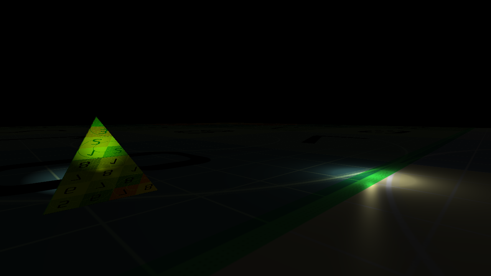

# Pogl

Pogl is my Playground for learning OpenGL and practicing C++.



### Goals
* Display 3d models
* Shade them with Blinn-Phong shading
* Render multiple objects with multiple shaders & multiple materials
* Directional lights, point lights, spotlights
* WASD movement + mouse camera

### Mindset
* "C with classes" approach:
    * no templates
    * no/minimal inheritace
    * Minimal use of standard library

### Future Work
* Load arbitrary models:
    * [Assimp](https://github.com/assimp/assimp) 
* Shadow maps
* More interesting shading:
    * [Disney/Unreal physically-based rendering](https://blog.selfshadow.com/publications/s2013-shading-course/)
* OpenGL optimization:
    * [Approaching Zero Driver Overhead in OpenGL](https://www.gdcvault.com/play/1020791)

## Prerequisites
* [vcpkg](https://github.com/microsoft/vcpkg)
* [CMake](https://cmake.org/download/)

``` 
vcpkg install opengl --triplet x64-windows
vcpkg install glew --triplet x64-windows
vcpkg install glfw3 --triplet x64-windows
vcpkg install glm --triplet x64-windows
vcpkg install assimp --triplet x64-windows
``` 

## Resources
* [Khronos OpenGL Wiki](https://www.khronos.org/opengl/wiki/Getting_Started)
* [Foundations of Game Engine Development vol. 2: Rendering](https://foundationsofgameenginedev.com/) 

## Credits
* UV Checker texture by Thomas Schmall 
    * https://www.oxpal.com/uv-checker-texture.html
